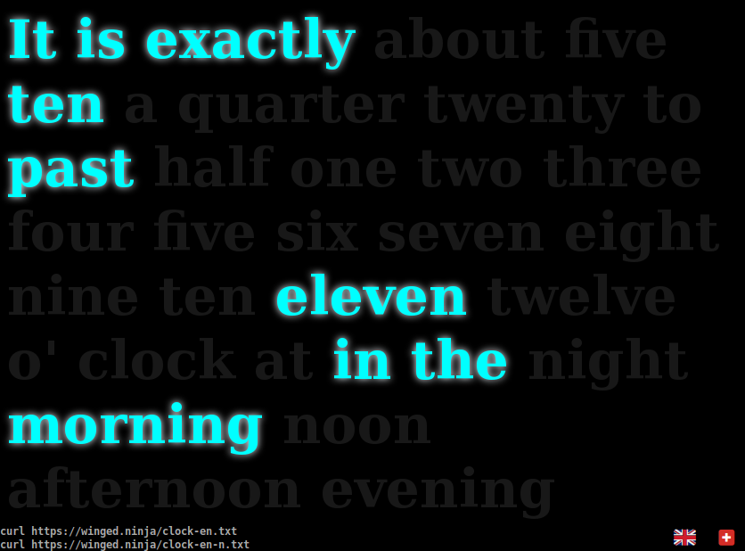

# TIEM.



## Web version

[Check it out](https://winged.ninja/clock.html)

## Commandline version

```bash
curl https://winged.ninja/clock-en.txt   # multiline
curl https://winged.ninja/clock-en-n.txt # inactive words hidden, one line
```

## Contributions

Contributions are welcome (other languages, fixes, etc). Please make sure to
extend both HTML and python versions.

This was built as a quick hack, don't expect it to be perfect in every aspect

## License

Do whatever you want with it (WTFPL)
